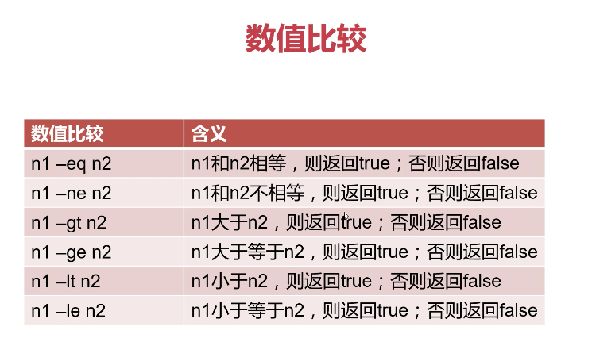
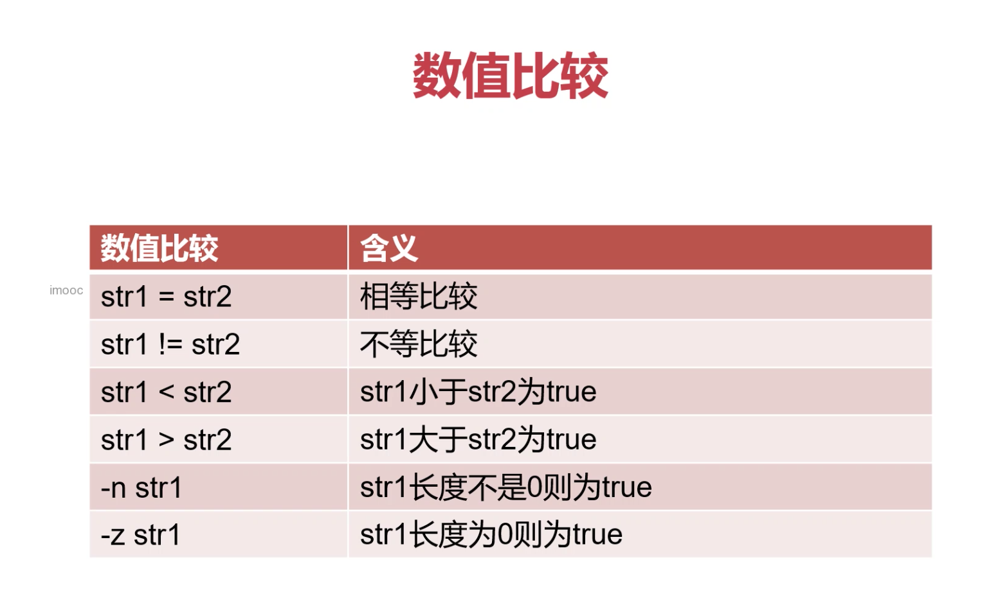
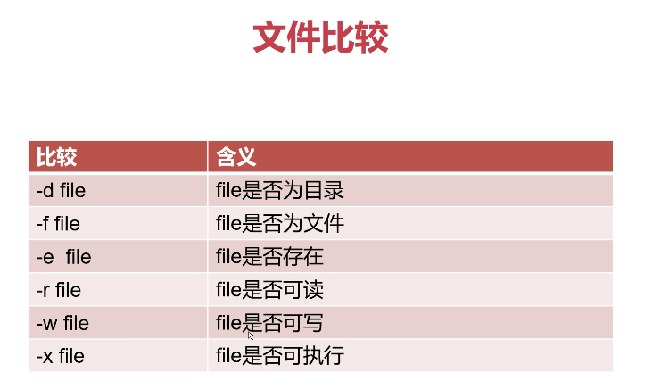
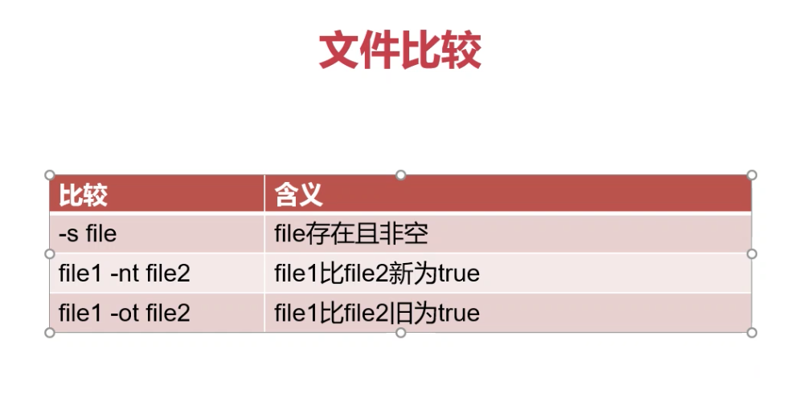
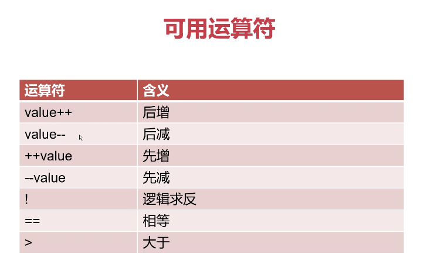
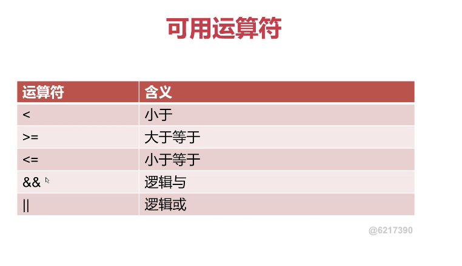

# shell-learn
李汇川的shell复习教程
## 自定义变量

### 变量名遵循原则 
- 变量是由任何字母、数字和下划线组成的字符串，且不能以数字开头 
- 区分字母大小写，例如Var1和varl是不同的 
- 变量、等号值中间不能出现任何空格
- 当一条命令或脚本执行时，后面可以跟多个参数我们使用位置参数 变量来表示这些参数

### 位置参数

[example](./location_var.sh)

[example_function](./func_sh.sh)

Linu×是一个多租户的操作系统，针对不同的用户都会有一个专有的 运行环境

### 退出状态码

- 所有的sh命令都使用退出状态码来告知sh它已执行完毕 
- 退出状态码是一个0一255的整数值 
- Linu×提供了一个$?来捕获退出状态码的值

[exit_code](./exit_code.sh)

### If 语句

[if_then](./if_then.sh)

[if_then-lese](./if_then_else.sh)

[if_elif_else](./if_elif_else.sh)

#### 数字比较
[condition](./condition.sh)

#### 字符串比较

[condition_str](./condition_str.sh)
   
#### 文件比较

[condition_file](./condition_file.sh)

#### && || 

[condition_mix](./condition_mix.sh)

#### 双括号(())

- 使用双括号可以进行算数运算，可以写类C语言的运算表达式 
- a++或者b—或者a+=1或者a<b或者a！=b

- 双括号结构中，变量名引用可以加$，也可以不加 
- 运算符前后可以有空格，也可以没有 
- 可以用于if、for、while等循环控制结构中

[double_bracker](./double_bracker.sh)

#### 双方括号[[]]

[double_square_bracket](./double_square_bracket.sh)

#### case

[case](./case.sh)

#### for

For小例子
[for_1](./for_1.sh) 

修改IFS
[for_2](./for_2.sh) 

系统命令
[for_3](./for_3.sh)

读取文件
[for_4](./for_4.sh)

C语言风格 for 循环
[for_5](./for_5.sh)
