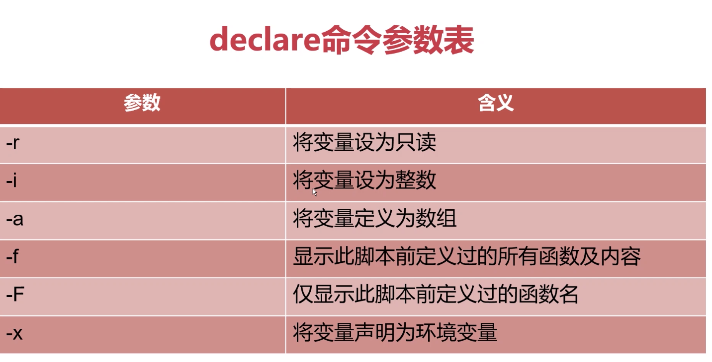

# shell-learn
李汇川的shell复习教程

## 变量替换

    variable="I love you,DO you love me?"
    var1=${variable#*ov}
    >e you,DO you love me?
    
    
[replace](./variable_replace.sh)

## 字符串长度

[string_operatiom](./string_operation.sh)

## String 操作项目

[string_project](./string_project.sh)

## 命令替换
方法1`command

方法2$(command)

#### 获取全部的user
[command](./command_example.sh)

#### 根据时间计算今年｜明年
[command2](./command_example2.sh)

    总结：``和$()两者是等价的，但推荐初学者使用$()，易于掌握；缺点是极少数UNIX可能不支持，但``都是支持的

	
	$(())主要用来进行整数运算，包括加减乘除,引用变量前面可以加$，也可以不加$

    $(( (100 + 30) / 13 ))
			
    num1=20;num2=30
    ((num++));
    ((num--))
    $(($num1+$num2*2))
    
#### 	根据系统时间获取今年还剩下多少星期，已经过了多少星期

[command3](./command_example3.sh)

#### 判定nginx进程是否存在，若不存在则自动拉起该进程

[command4](./command_example4.sh)

#### 由类型变量

- declare命令和typeset命令两者等价 
- declare、typeset命令都是用来定义变量类型的

