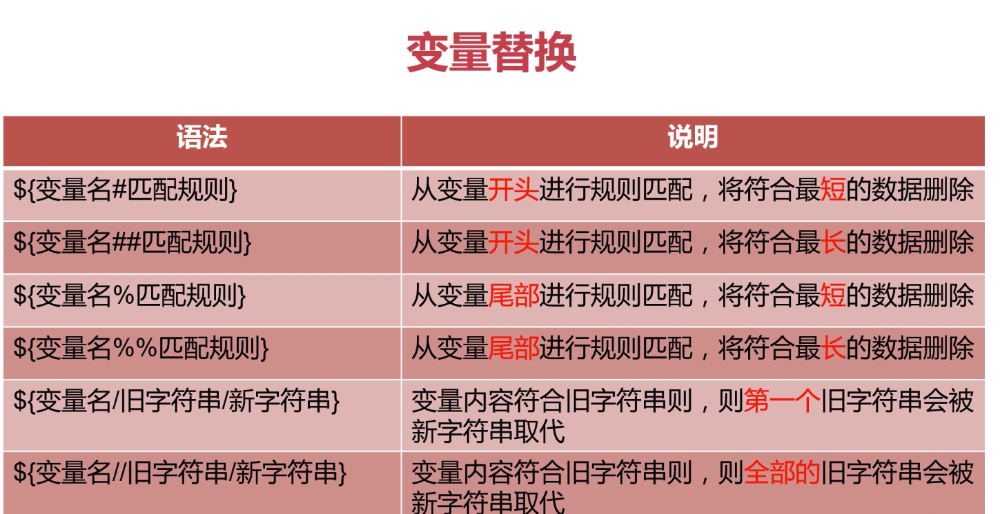
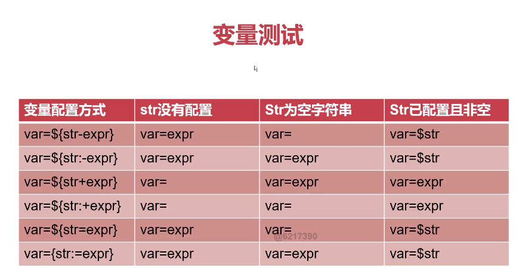
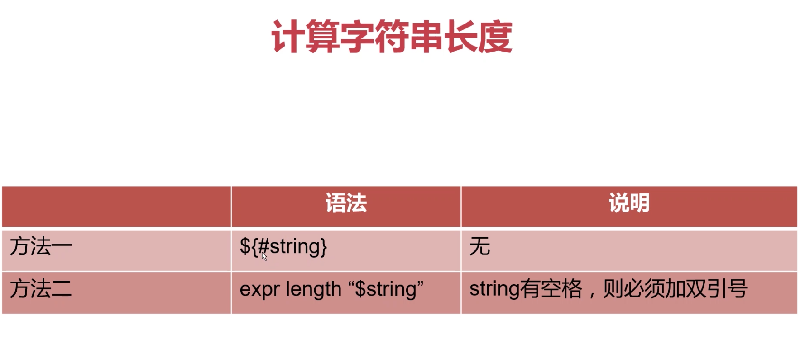
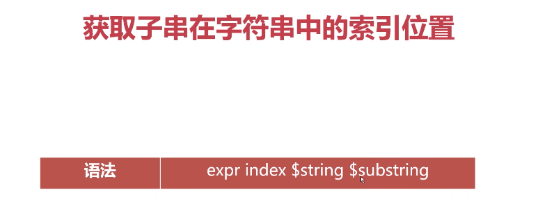
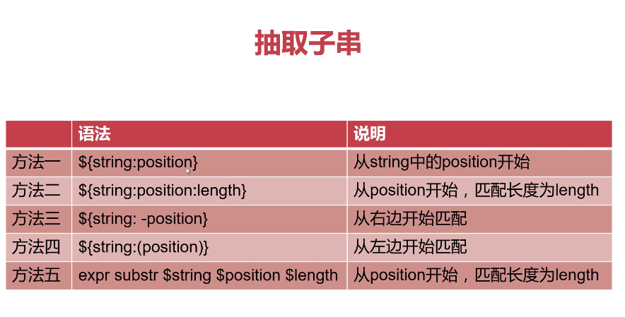
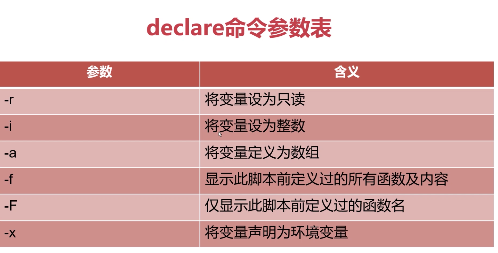
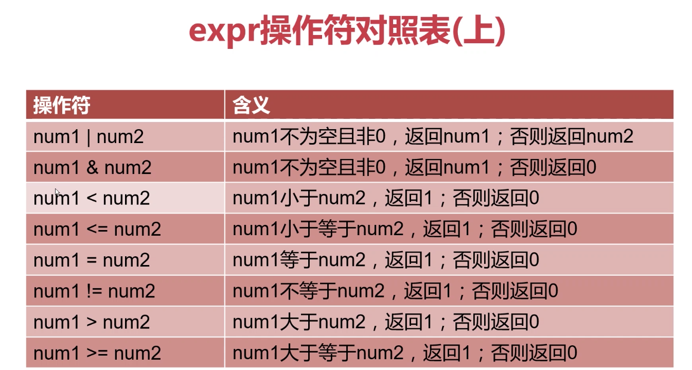
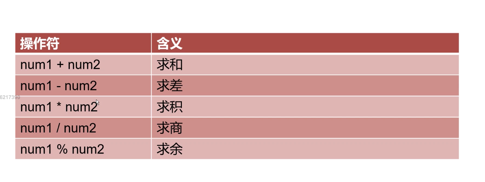

# shell-learn
李汇川的shell复习教程

## 变量替换

    variable="I love you,DO you love me?"
    var1=${variable#*ov}
    >e you,DO you love me?
    
    
[replace](./variable_replace.sh)

## 字符串长度

[string_operatiom](./string_operation.sh)

## String 操作项目

[string_project](./string_project.sh)

## 命令替换
方法1`command

方法2$(command)

#### 获取全部的user
[command](./command_example.sh)

#### 根据时间计算今年｜明年
[command2](./command_example2.sh)

    总结：``和$()两者是等价的，但推荐初学者使用$()，易于掌握；缺点是极少数UNIX可能不支持，但``都是支持的

	
	$(())主要用来进行整数运算，包括加减乘除,引用变量前面可以加$，也可以不加$

    $(( (100 + 30) / 13 ))
			
    num1=20;num2=30
    ((num++));
    ((num--))
    $(($num1+$num2*2))
    
#### 	根据系统时间获取今年还剩下多少星期，已经过了多少星期

[command3](./command_example3.sh)

#### 判定nginx进程是否存在，若不存在则自动拉起该进程

[command4](./command_example4.sh)

#### 由类型变量

- declare命令和typeset命令两者等价 
- declare、typeset命令都是用来定义变量类型的

	有类型变量总结：
	
		1、declare -r	#声明变量为只读类型
		
			declare -r var="hello"
			var="world"				-bash: var: readonly variable
			
		2、declare -i	#声明变量类型为整型
		
			num1=2001
			num2=$num1+1
			echo $num2
			
			declare -i num2
			num2=$num1+1
			echo $num2
		
		3、declare -f		在脚本中显示定义的函数和内容		
		4、declare -F		在脚本中显示定义的函数
		5、declare -a
		
			array=("jones" "mike" "kobe" "jordan")
			
			输出数组内容：											
			
						echo ${array[@]}	输出全部内容
						echo ${array[1]}	输出下标索引为1的内容
			
			获取数组长度：											
						
						echo ${#array}		数组内元素个数
						echo ${#array[2]}	数组内下标索引为2的元素长度
						
			给数组某个下标赋值：									
			
						array[0]="lily"				给数组下标索引为1的元素赋值为lily
						array[20]="hanmeimei"		在数组尾部添加一个新元素
						
			删除元素：												
			
						unset array[2]		清除元素
						unset array			清空整个数组
						
			分片访问：												
			
						${array[@]:1:4}		显示数组下标索引从1开始到3的3个元素，不显示索引为4的元素
						
			内容替换：												
			
						${array[@]/an/AN}	将数组中所有元素内包含kobe的子串替换为mcgrady
						
			数组遍历：
					for v in ${array[@]}
					do
							echo $v
					done
														
		
		6、declare -x
		
			声明为环境变量，可以在脚本中直接使用
		
	取消声明的变量：
	
		declare +r
		declare +i
		declare +a
		declare +X
		
#### 数学运算
    1。 expr $num1 operator $num2
    2. $(($num1 operator $num2))
    

### 练习例子：

    提示用户输入一个正整数num，然后计算1+2+3+...+sum的值；必须对num是否为正整数做判断，不符合应当允许再此输入
    
[operator_example](./operator1.sh)

### BC
- bc是bash内建的运算器，支持浮点数运算 
- 0内建变量scale可以设置，默认为0

和 expr 一样
num1^num2

##### 设置scale=2
    echo "23+35" |bc
    echo "scale=4;23.3+35.3" |bc

[bc_example](./bc_test.sh)

### 函数
- 直接使用函数名调用，可以将其想象成Shell中的一条命令
- 函数内部可以直接使用参数$1、$2....$n
- 调用函数function name $1 $2
name(){
}

function name{
}

    function greering
    {
        echo "hello,zhangsan"
    }

nginx 守护进程
[nginx_daemon](./nginx_daemon.sh)

需求描述：写一个脚本，该脚本可以实现计算器的功能，可以进行+-*/四种计算。

例如：sh calculate.sh 30 + 40		| sh calculate.sh 30 - 40		| sh calculate.sh 30 * 40
[calculate](./calculate.sh)

#### 函数返回值
使用return返回值，只能返回1一255的整数 
函数使用return返回值，通常只是用来供其他地方调用获取状态 此通常仅返回0或1；0表示成功1表示失败
[return_example](./is_nginx_running.sh)

使用echo返回值：

[echo_example](./user_list.sh)

#### 全局变量 && 局部变量

不做特殊声明，Shell中变量都是全局变量
local 关键字
函数内和外若存在同名变量，则函数内部变量覆盖外部变量

[local_variable](./local_variable.sh)

#### 函数库

