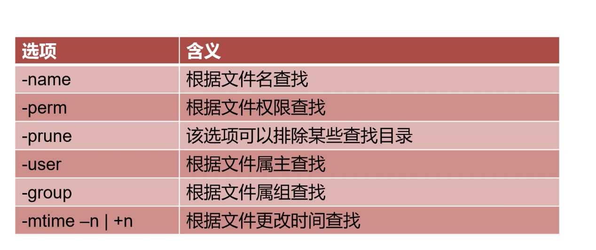
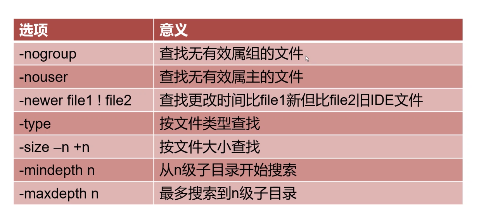
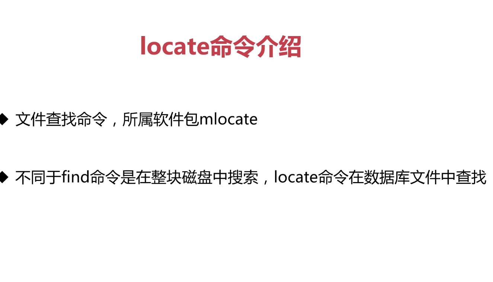
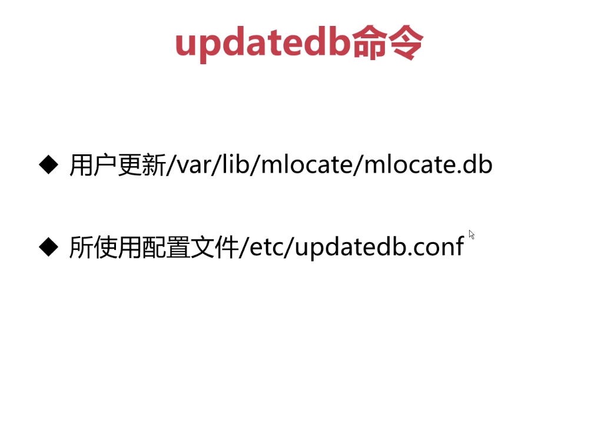
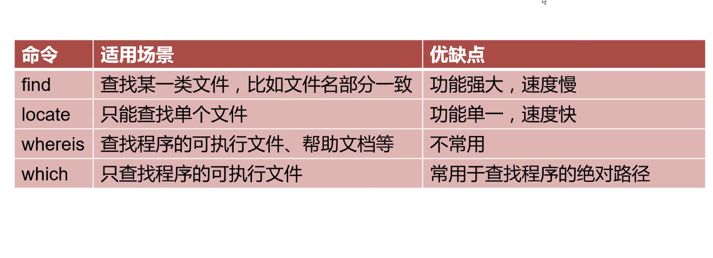

# shell-learn
李汇川的shell复习教程

## find 命令
语法格式 find [路径][选项][操作]

选项

find命令总结：

	常用选项：
	
		-name			查找/etc目录下以conf结尾的文件，区分大小写	find /etc -name '*.conf'
		-iname			查找当前目录下文件名为aa的文件，不区分大小写	find . -iname aa
		-user			查找文件属主为hdfs的所有文件	find . -user hdfs
		-group			查找文件属组为yarn的所有文件	find . -group yarn		
		-type			
		
			f		文件				find . -type f 
			d		目录				find . -type d
			c		字符设备文件		find . -type c
			b		块设备文件			find . -type b
			l		链接文件			find . -type l
			p		管道文件			find . -type p
			
		
		-size
		
			-n		小于大小n的文件
			+n		大于小于n的文件
			
			例子1：查找/etc目录下小于10000字节的文件		find /etc -size -10000c
			例子2：查找/etc目录下大于1M的文件				find /etc -size +1M
		
		-mtime		
		
			-n		n天以内修改的文件
			+n		n天以外修改的文件
			n		正好n天修改的文件
			
			例子1：查找/etc目录下5天之内修改且以conf结尾的文件	find /etc -mtime -5 -name '*.conf'
			例子2：查找/etc目录下10天之前修改且属主为root的文件	find /etc -mtime +10 -user root
			
		-mmin
			
			-n		n分钟以内修改的文件
			+n		n分钟以外修改的文件
			
			例子1：查找/etc目录下30分钟之前修改的文件		find /etc -mmin +30
			例子2：查找/etc目录下30分钟之内修改的目录		find /etc -mmin -30 -type d
		
		-mindepth n		表示从n级子目录开始搜索
		
			例子：在/etc下的3级子目录开始搜索		find /etc -mindepth 3 
		
		-maxdepth n		表示最多搜索到n级子目录
		
			例子1：在/etc下搜索符合条件的文件，但最多搜索到2级子目录		find /etc -maxdepth 3 -name '*.conf'
			例子2：
				find ./etc/ -type f -name '*.conf' -size +10k -maxdepth 2
		
			
		
		
	了解选项：
	
		-nouser		查找没有属主的用户
		
			例子：find . -type f -nouser
		
		-nogroup	查找没有属组的用户
		
			例子：find . -type f -nogroup
		
		-perm
		
			例子：find . -perm 664
		
		-prune
		
			通常和-path一起使用，用于将特定目录排除在搜索条件之外
			例子1：查找当前目录下所有普通文件，但排除test目录
				find . -path ./etc -prune -o -type f
			例子2：查找当前目录下所有普通文件，但排除etc和opt目录
				find . -path ./etc -prune -o -path ./opt -prune -o -type f
			例子3：查找当前目录下所有普通文件，但排除etc和opt目录，但属主为hdfs
				find . -path ./etc -prune -o -path ./opt -prune -o -type f -a -user hdfs
			例子4：查找当前目录下所有普通文件，但排除etc和opt目录，但属主为hdfs，且文件大小必须大于500字节
				find . -path ./etc -prune -o -path ./opt -prune -o -type f -a -user hdfs -a -size +500c
		
		-newer file1
		
			例子：find /etc -newer a
			
	操作：
	
	
		-print		打印输出
		
		-exec		对搜索到的文件执行特定的操作，格式为-exec 'command' {} \;
		
			例子1：搜索/etc下的文件(非目录)，文件名以conf结尾，且大于10k，然后将其删除
			
				find ./etc/ -type f -name '*.conf' -size +10k -exec rm -f {} \;
				
			例子2：将/var/log/目录下以log结尾的文件，且更改时间在7天以上的删除
			
				find /var/log/ -name '*.log' -mtime +7 -exec rm -rf {} \;
				
			例子3：搜索条件和例子1一样，只是不删除，而是将其复制到/root/conf目录下
			
				find ./etc/ -size +10k -type f -name '*.conf' -exec cp {} /root/conf/ \;
				
		-ok			和exec功能一样，只是每次操作都会给用户提示
		
	逻辑运算符：
	
		-a			与
		-o			或
		-not|!		非
		
		例子1：查找当前目录下，属主不是hdfs的所有文件		
		
			find . -not -user hdfs 	|	find . ! -user hdfs
		
		例子2：查找当前目录下，属主属于hdfs，且大小大于300字节的文件
		
			find . -type f -a -user hdfs -a -size +300c
			
		例子3：查找当前目录下的属主为hdfs或者以xml结尾的普通文件
			
			find . -type f -a \( -user hdfs -o -name '*.xml' \)
			
## find && locate && whereis && which

### locate 是一个部分匹配的文件

### whereis 

-b 只返回二进制文件 
-m 只返回帮助文档文件 
-s 只返回源代码文件

### which 
 
作用：仅查找二进制程序文件

		