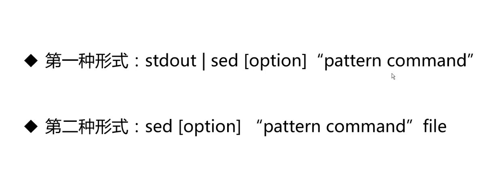
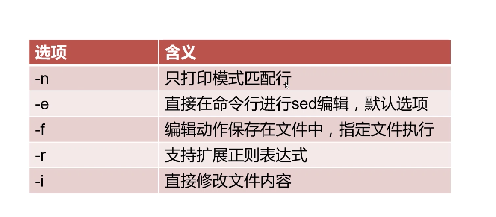
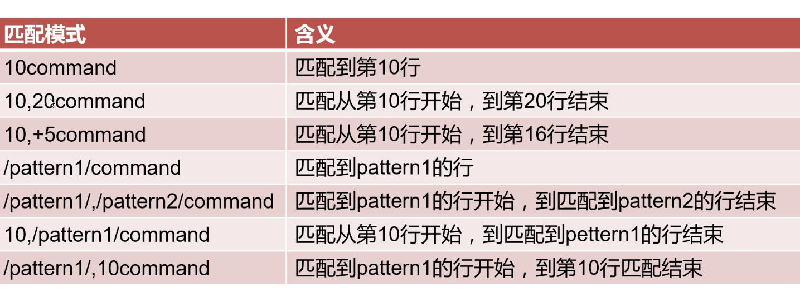

# shell-learn
李汇川的shell复习教程

# 文本处理三剑客 
- grep 命令 过滤器
- sed 编辑器
- awk 报告生成器

## sed

sed(Stream Editor)，流编辑器。对标准输出或文件逐 行进行处理

### sed 选项

    打印两次
    sed 'p' sed.txt
    
    sed -n 'p' sed.txt
    
    // 查找包含 py 的行    
    sed -n '/py.*/p' sed.txt
    
    // 多个匹配
    sed -n -e '/py.*/p' -e '/PY/p' sed.txt
    
    // 使用文件    
    sed -n -f edit.sed sed.txt 
    
    // 扩展正则表达式
    sed -n -r '/py|PY/p' sed.txt
    
    // 直接替换
    sed -n  's/love/like/g;p' sed.txt
    
    // 文件内部替换
    sed -i 's/love/like/g' sed.txt

### 匹配模式

    