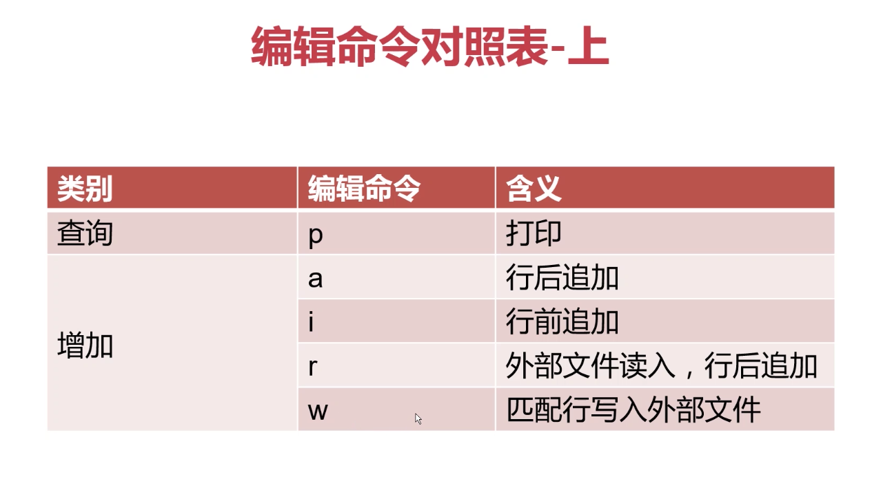
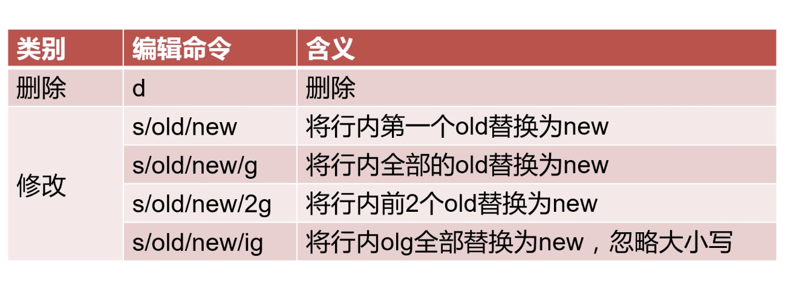
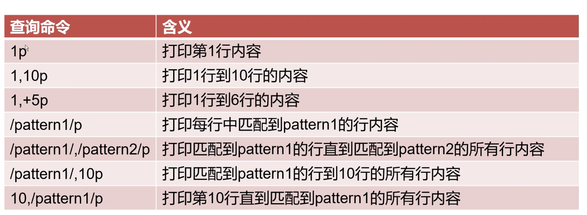

# shell-learn
李汇川的shell复习教程

# 文本处理三剑客 
- grep 命令 过滤器
- sed 编辑器
- awk 报告生成器

## sed

sed(Stream Editor)，流编辑器。对标准输出或文件逐 行进行处理

### sed 选项

    打印两次
    sed 'p' sed.txt
    
    sed -n 'p' sed.txt
    
    // 查找包含 py 的行    
    sed -n '/py.*/p' sed.txt
    
    // 多个匹配
    sed -n -e '/py.*/p' -e '/PY/p' sed.txt
    
    // 使用文件    
    sed -n -f edit.sed sed.txt 
    
    // 扩展正则表达式
    sed -n -r '/py|PY/p' sed.txt
    
    // 直接替换
    sed -n  's/love/like/g;p' sed.txt
    
    // 文件内部替换
    sed -i 's/love/like/g' sed.txt

### 匹配模式

1. LineNumber

    sed -n "1p" file  打印第一行
    
    10 -20 行 
    
    sed -n "10,20p" passwd
    
    10 +5 10～16
    
    sed -n "10,+5p" passwd
    
    匹配 字符串
    
    sed -n "/bash/p" passwd
    
    sed -n "/\/sbin\/nologin/p" passwd
    
    匹配 ^hdfs
    
    sed -n "/^hdfs/p" passwd
    
    匹配从第一个匹配的后一个匹配
    
    sed -n "/^root/,/^yarn/p" passwd
    
    匹配4行开始到^yarn结束    
    
    sed -n "4,/^yarn/p" passwd 

    
### sed 的编辑命令详解

       删除
       sed '1d' passwd 
       sed -i '1,3d' passwd 
       
       sed -i '/\/sbin\/nologin/d' passwd
       
       sed -i '/^mail/,/^ftp/d' passwd
       
       增加：
       最后添加
       sed -i '\/bin\/bash/a This is a user which can login to system'  passwd
       行前添加
       sed -i '/^hdfs/,/^yarn/i AAAAAAA' passwd 
       # 写到文件中
       sed -n '/root/r list' passwd
       # 写出文件
       sed -i '/\/bin\/bash/w ./login.txt' passwd
       
       修改：
       s/pattern/string/ 查找并替换一行第一个
       
       s/pattern/string/g 查找并替换全部
       
       s/pattern/string/ig 查找并替换 忽略大小写
       
       s/pattern/string/2g 从第二个开始替换所有的
       
       s/pattern/string/2 始替换第二个的
       
       # 替换掉
       sed 's/\/bin\/bash/\/BIN\/BASH/g' passwd
       
       sed 's/root/ROOT/' passwd
       
       # 替换的是后两个
       sed 's/root/ROOT/2g' passwd
       
       其他：
       = 显示行号
       
       sed -n '/root/=' passwd
       
        
        1、修改/etc/passwd中第1行中第1个root为ROOT	
            sed -i '1s/root/ROOT/' passwd
        2、修改/etc/passwd中第5行到第10行中所有的/sbin/nologin为/bin/bash
            sed -i '5,10s/\/sbin\/nologin/\/bin\/bash/g' passwd
        3、修改/etc/passwd中匹配到/sbin/nologin的行，将匹配到行中的login改为大写的LOGIN
            sed -i '/\/sbin\/nologin/s/login/LOGIN/g' passwd
        4、修改/etc/passwd中从匹配到以root开头的行，到匹配到行中包含mail的所有行。修改内为将这些所有匹配到的行中的bin改为HADOOP
            sed -i '/^root/,/mail/s/bin/HADOOP/g' passwd
        5、修改/etc/passwd中从匹配到以root开头的行，到第15行中的所有行，修改内容为将这些行中的nologin修改为SPARK
            sed -i '/^root/,15s/nologin/SPARK/g' passwd
        6、修改/etc/passwd中从第15行开始，到匹配到以yarn开头的所有航，修改内容为将这些行中的bin换位BIN
            sed -i '15,/^yarn/s/bin/BIN/g' passwd
        
       # 反向引用
       
       sed -i 's/had..p/&/ig' str.txt 
       &  
       \1 可以部分替换
       
       # 可以替换       
       sed -i 's/\(had\)....../\1doop/ig' str.txt

      查找：
      1. 打印/etc/passwd中的20行
      sed -n '20p' /etc/passwd
      2. 8-15行打印
      sed -n '8,15p' passwd
      3. 8行+5行结束内容
      sed -n '8,+5p' passwd
      4. 打印hdfs 开头的内容
      sed -n '/^hdfs/p' passwd
      5. 打印root 开头到hdfs结束的行的内容
      sed -n '/^root/,/^hdfs/p' passwd
      
      # 处理my.cnf
      
      
      
      

[sed example](./mysql_process.sh)

### sed 删除内容
    用法总结：

    1、1d
    2、5,10d
    3、10,+10d
    4、/pattern1/d
    5、/pattern1/,/pattern2/d
    6、/pattern1/,20d
    7、15,/pattern1/d
       
    练习例子：
		
    1、删除/etc/passwd中的第15行	
        sed -i '15d' /etc/passwd
    2、删除/etc/passwd中的第8行到第14行的所有内容	
        sed -i '8,14d' passwd
    3、删除/etc/passwd中的不能登录的用户(筛选条件：/sbin/nologin)	
        sed -i '/\/sbin\/nologin/d' passwd
    4、删除/etc/passwd中以mail开头的行，到以yarn开头的行的所有内容		
        sed -i '/^mail/,/^yarn/d' passwd
    5、删除/etc/passwd中第一个不能登录的用户，到第13行的所有内容
        sed -i '/\/sbin\/nologin/,13d' passwd
    6、删除/etc/passwd中第5行到以ftp开头的所有行的内容
        sed -i '5,/^ftp/d' passwd
    7、删除/etc/passwd中以yarn开头的行到最后行的所有内容	
        sed -i '/^yarn/,$d' passwd
    
    1、删除配置文件中的所有注释行和空行
		sed -i '/[:blank:]*#/d;/^$/d' nginx.conf
    2、在配置文件中所有不以#开头的行前面添加*符号，注意：以#开头的行不添加
        sed -i 's/^[^#]/\*&/g' nginx.conf
       