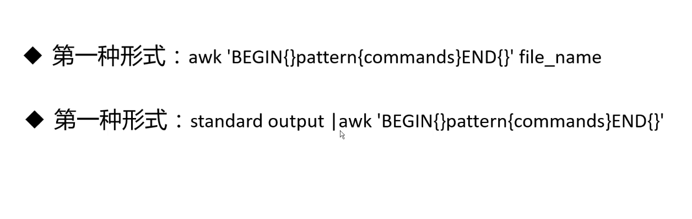
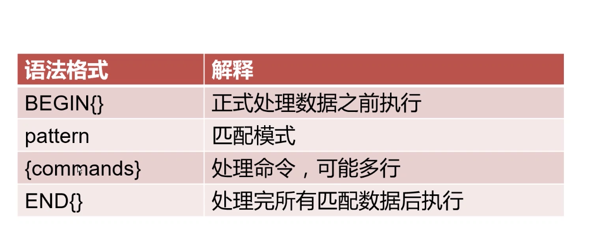
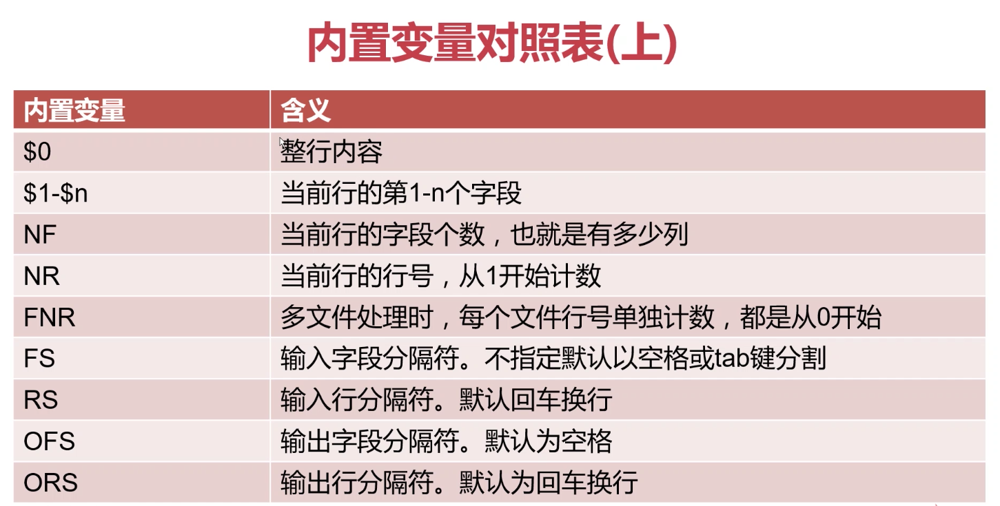
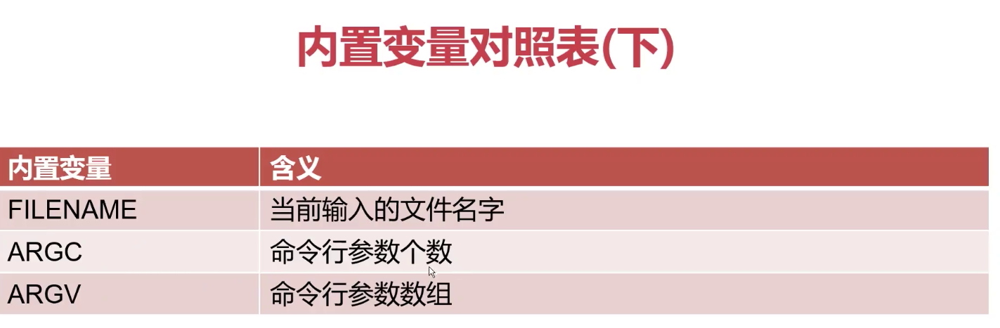
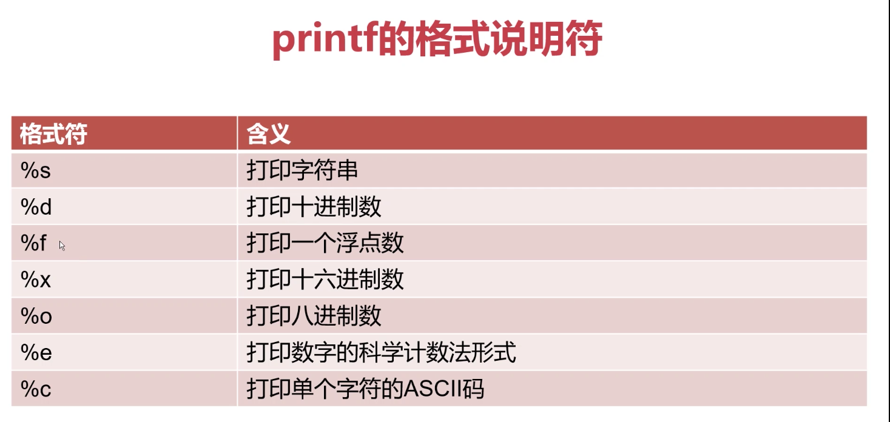

# shell-learn
李汇川的shell复习教程

# 文本处理三剑客 
- grep 命令 过滤器
- sed 编辑器
- awk 报告生成器

## awk 报告生成器

awk是一个文本处理工具，通常用于处理数据并生成结果报告

awk的命名是它的创始人AlfredAho，Peter Weinberger 和Brian Kernighan姓氏的首个字母组成的

### awk 内置变量

	内置变量：
			$0					打印行所有信息
			$1~$n				打印行的第1到n个字段的信息
			NF	Number Field				处理行的字段个数
			NR	Number Row					处理行的行号
			FNR	File Number Row				多文件处理时，每个文件单独记录行号
			FS	Field Separator				字段分割符，不指定时默认以空格或tab键分割
			RS	Row Separator				行分隔符，不指定时以回车分割\n
			OFS	 Output Filed Separator		输出字段分隔符。
			ORS	 Output Row Separator		输出行分隔符
			FILENAME			处理文件的文件名
			ARGC				命令行参数个数
			ARGV				命令行参数数组

### awk 命令例子
    awk '{print $0}' passwd
    
    awk 'BEGIN{FS=":"} {print $1}' passwd

##### uid

    awk 'BEGIN{FS=":"} {print $3}' passwd
    
    awk '{print $1}' list
### 字段的个数
    awk '{print NF}' list
    
    awk '{print NR}' list list
    
    awk '{print FNR}' list list
    
    awk 'BEGIN{RS="\t";FS="|";ORS="&"}{print $1,$3}' list list
    
    awk 'BEGIN{ORS="&"}{print $1,$3}' list list
    
    输出文件名
    awk '{print FILENAME}' list
    
    
    awk '{print ARGC}' list
    
    $NF 最后一个字段
    awk 'BEGIN{FS=":"}{print $NF}' passwd

### printf

    
    	-		左对齐
        +		右对齐
        #		显示8进制在前面加0，显示16进制在前面加0x

    awk 'BEGIN{FS=":"}{printf $1}' passwd
    awk 'BEGIN{FS=":"}{printf "%s\n",$1}' passwd
    awk 'BEGIN{FS=":"}{printf "%s-%s\n",$1,$7}' passwd
    20 占位
    awk 'BEGIN{FS=":"}{printf "%20s-%20s\n",$1,$7}' passwd
    左对齐
    awk 'BEGIN{FS=":"}{printf "%-20s-%-20s\n",$1,$7}' passwd
    格式符示例：
        1、以字符串格式打印/etc/passwd中的第7个字段，以":"作为分隔符
        
            awk 'BEGIN{FS=":"} {printf "%s",$7}' /etc/passwd
        
        2、以10进制格式打印/etc/passwd中的第3个字段，以":"作为分隔符
        
            awk 'BEGIN{FS=":"} {printf "%d\n",$3}' /etc/passwd
        
        3、以浮点数格式打印/etc/passwd中的第3个字段，以":"作为分隔符
        
            awk 'BEGIN{FS=":"} {printf "%0.3f\n",$3}' /etc/passwd
        
        4、以16进制数格式打印/etc/passwd中的第3个字段，以":"作为分隔符
        
            awk 'BEGIN{FS=":"} {printf "%#x\n",$3}' /etc/passwd
        
        5、以8进制数格式打印/etc/passwd中的第3个字段，以":"作为分隔符
        
            awk 'BEGIN{FS=":"} {printf "%#o\n",$3}' /etc/passwd
        
        6、以科学计数法格式打印/etc/passwd中的第3个字段，以":"作为分隔符
              awk 'BEGIN{FS=":"} {printf "%e\n",$3}' /etc/passwd
        
    
## awk模式匹配用法总结：

	第一种方法：RegExp
	第二种方法：运算符匹配
	
	1、RegExp
	
		匹配/etc/passwd文件行中含有root字符串的所有行
			awk 'BEGIN{FS=":"}/root/{print $0}' /etc/passwd
		匹配/etc/passwd文件行中以yarn开头的所有行
			awk 'BEGIN{FS=":"}/^yarn/{print $0}' /etc/passwd
    2、运算符匹配
	
		关系运算符匹配：
			<			小于
			>			大于
			<=			小于等于
			>=			大于等于
			==			等于
			!=			不等于
			~			匹配正则表达式
			!~			不匹配正则表达式
    (1)、以:为分隔符，匹配/etc/passwd文件中第3个字段小于50的所有行信息
        awk 'BEGIN{FS=":"}$3<50{print $0}' /etc/passwd
    (2)、以:为分隔符，匹配/etc/passwd文件中第3个字段大于50的所有行信息
        awk 'BEGIN{FS=":"}$3>50{print $0}' /etc/passwd
    (3)、以:为分隔符，匹配/etc/passwd文件中第7个字段为/bin/bash的所有行信息
        awk 'BEGIN{FS=":"}$7=="/bin/bash"{print $0}' /etc/passwd
    (4)、以:为分隔符，匹配/etc/passwd文件中第7个字段不为/bin/bash的所有行信息
        awk 'BEGIN{FS=":"}$7!="/bin/bash"{print $0}' /etc/passwd
    (5)、以：为分隔符，匹配/etc/passwd中第3个字段包含3个以上数字的所有行信息
        awk 'BEGIN{FS=":"}$3~/[0-9]{3,}/{print $0}' /etc/passwd
        
    布尔运算符匹配：
			||			或
			&&			与
			!			非
			
    (1)、以:为分隔符，匹配/etc/passwd文件中包含hdfs或yarn的所有行信息
        awk 'BEGIN{FS=":"}$1=="hdfs" || $1=="yarn" {print $0}' /etc/passwd
    (2)、以:为分隔符，匹配/etc/passwd文件中第3个字段小于50并且第4个字段大于50的所有行信息
        awk 'BEGIN{FS=":"}$3<50 && $4>50 {print $0}' /etc/passwd
		
## awk动作中的表达式用法总结：

    算数运算符
		+				加
		-				减
		*				乘
		/				除
		%				取模
		^或**			乘方
		++x				在返回x变量之前，x变量加1
		x++				在返回x变量之后，x变量加1
		--x				在返回x变量之前，x变量减1
		x--				在返回x变量之后，x变量减1
			
	awk 'BEGIN{var=20;var1="hello";print var,var1}'
    awk 'BEGIN{num1=20;num2+=num1;print num1,num2}'
    
    awk 'BEGIN{num1=20;num2-=num1;print num1,num2}'
    awk 'BEGIN{num1=20;num2*=num1;print num1,num2}'
    awk 'BEGIN{num1=20;num2/=num1;print num1,num2}'
    awk 'BEGIN{x=20;y=x++;print x,y}'
    awk 'BEGIN{x=20;y=++x;print x,y}'

    1、使用awk计算/etc/services中的空白行数量
        awk '/^$/{sum=0;sum++}END{print sum}' passwd 
    2. 计算学生课程分数平均值，学生课程文件内容如下：
     awk 'BEGIN{printf "%-8s%-8s%-8s%-8s%-8s%s\n","Name","Yuwen","Math","English","Pysical","Average"}{total=$2+$3+$4+$5;AVG=total/4;printf "%-8s%-8d%-8d%-8d%-8d%0.2f\n",$1,$2,$3,$4,$5,AVG}' student.txt

## awk动作中的条件及循环语句
    条件语句：
		
			if(条件表达式1)
				动作
			else if(条件表达式2)
				动作
			else
				动作
				
		循环语句：
		
			while循环:
				while(条件表达式)
					动作
					
			do while循环:
				do
					动作
				while(条件表达式)
				
			for循环:
				for(初始化计数器;计数器测试;计数器变更)
					动作
    1、以:为分隔符，只打印/etc/passwd中第3个字段的数值在50-100范围内的行信息
        awk 'BEGIN{FS=":"} {if{$2>50} print $0}' passwd

[awk代码](./script.awk)	
    
    awk -f script.awk passwd
2、计算1+2+3+4+...+100的和，请使用while、do while、for三种循环方式实现
[awk代码-while](./while.awk)		
[awk代码-for](./for.awk)		
[awk代码-do while](./do-while.awk)		

[student.awk](./student.awk)

## awk字符串函数

	length(str)						计算长度
	index(str1,str2)				返回在str1中查询到的str2的位置
	tolower(str)					小写转换
	toupper(str)					大写转换	
	split(str,arr,fs)				分隔字符串，并保存到数组中
	match(str,RE)					返回正则表达式匹配到的子串的位置
	substr(str,m,n)					截取子串，从m个字符开始，截取n位。n若不指定，则默认截取到字符串尾
	sub(RE,RepStr,str)				替换查找到的第一个子串
	gsub(RE,RepStr,str)				替换查找到的所有子串
    
1.以:为分隔符，返回/etc/passwd中每行中每个字段的长度	
root:x:0:0:root:/root:/bin/bash
4:1:1:1:4:5:9
    
[str_example](./str_example.awk)

2、搜索字符串"I have a dream"中出现"ea"子串的位置
    
     1) awk 'BEGIN{str="I hava a dream";location=index(str,"ea");print location}'
     2) awk 'BEGIN{str="I hava a dream";location=match(str,"ea");print location}'

3、将字符串"Hadoop is a bigdata Framawork"全部转换为小写

    awk 'BEGIN{str="Hadoop is a bigdata Framework";print tolower(str)}'
4、将字符串"Hadoop is a bigdata Framawork"全部转换为大写
		
	awk 'BEGIN{str="Hadoop is a bigdata Framework";print toupper(str)}'

5、将字符串"Hadoop Kafka Spark Storm HDFS YARN Zookeeper"，按照空格为分隔符，分隔每部分保存到数组array中
    
    awk 'BEGIN{str="Hadoop Kafka Spark Storm HDFS YARN Zookeeper";split(str,arr);for(a in arr) print arr[a]}'
    
6.搜索字符串"Tranction 2345 Start:Select * from master"第一个数字出现的位置

    awk 'BEGIN{str="Tranction 2345 Start:Select * from master";location=match(str,/[0-9]/);print location}'
    
7、截取字符串"transaction start"的子串，截取条件从第4个字符开始，截取5位
		
	awk 'BEGIN{str="transaction start";print substr(str,4,5)}'
	awk 'BEGIN{str="transaction start";print substr(str,4)}'
8、替换字符串"Tranction 243 Start,Event ID:9002"中第一个匹配到的数字串为$符号
    
    awk 'BEGIN{str="Tranction 243 Start,Event ID:9002";count=sub(/[0-9]+/,"$",str);print count,str}'
    awk 'BEGIN{str="Tranction 243 Start,Event ID:9002";count=gsub(/[0-9]+/,"$",str);print count,str}'